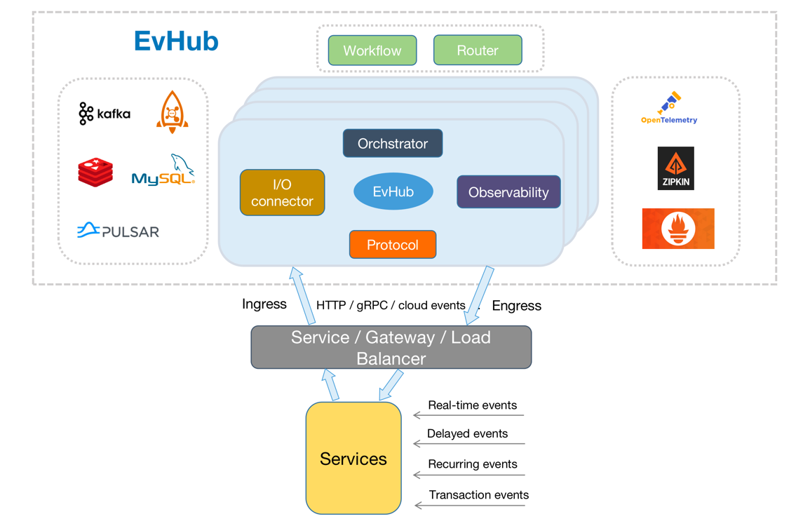

# Evhub

English | [简体中文](README_CN.md)


## Infra

EvHub is an event-driven runtime that provides a unified event model, retrieves asynchronous events, and distributes events to application scenarios to decouple upstream and downstream systems. Support real-time, delay, loop and transaction event scenarios, to achieve high real-time, high reliable general event components. It makes it easy for developers to build event-driven architecture stateless microservices.
## Features
* Multi-protocol: Supports multiple protocols, such as HTTP and gRPC
* Support for transactional messages
* Supports delay events, including normal delay events and delay processing events
* Recurring events are supported, including regular recurring  events and crontab events
* Supports multiple event stores: Kafka, Pulsar, Mysql, Redis, etc
* Support for multiple microservice architectures
* Supports high availability and easy horizontal expansion


## Application scenarios.
EvHub can be applied to data consistency problems in a large number of scenarios,here are a few common ones
* Peak cut
* Broadcast
* Cache management
* System decoupling, event driven: Greatly simplifying the architectural complexity
* Distributed transaction

### run EvHub

``` bash
make start
```

### stop EvHub

``` bash
make stop
```

### Configuration
```bash
curl --location --request POST '127.0.0.1:8081/v1/producer' \
--header 'Content-Type: application/json' \
--data-raw '{
    "producer_conf_info":{
        "app_id":"eh",
        "topic_id":"test",
        "tx_protocol_type":0,
        "tx_address":"addr",
        "tx_callback_interval":5000
    }
}'

curl --location --request POST '127.0.0.1:8081/v1/processor' \
--header 'Content-Type: application/json' \
--data-raw '{
    "processor_conf_info":{
        "dispatcher_id":"evhub_eh_test_addr1",
        "app_id":"eh",
        "topic_id":"test",
        "timeout":5000,
        "protocol_type":"grpcSend",
        "addr":"ip:6001",
        "retry_strategy":{
            "retry_interval": 5000,
            "retry_count":3
        }
    }
}'

```

### Code
``` GO
package main

import (
	"context"
	"time"

	"github.com/tencentmusic/evhub/pkg/gen/proto/comm"
	"github.com/tencentmusic/evhub/pkg/grpc"
	"github.com/tencentmusic/evhub/pkg/grpc/interceptor"
	"github.com/tencentmusic/evhub/pkg/log"

	eh_pc "github.com/tencentmusic/evhub/pkg/gen/proto/processor"
	eh_pd "github.com/tencentmusic/evhub/pkg/gen/proto/producer"
	ggrpc "google.golang.org/grpc"
)

func main() {
	serverAddr := ":6001"
	addr := "127.0.0.1:9000"
	timeout := time.Second * 5
	conn, err := grpc.Dial(&grpc.ClientConfig{Addr: addr, Timeout: timeout})
	if err != nil {
		log.Panicf("dial err:%v", err)
	}
	defer conn.Close()
	// grpc client
	rsp, err := eh_pd.NewevhubProducerClient(conn).Report(context.Background(), &eh_pd.ReportReq{
		Event: &comm.Event{
			AppId:   "eh",
			TopicId: "test",
		},
		Trigger: &comm.EventTrigger{
			TriggerType: comm.EventTriggerType_EVENT_TRIGGER_TYPE_REAL_TIME,
		},
	})
	if err != nil {
		log.Panicf("report err:%v", err)
	}
	if rsp.Ret != nil && rsp.Ret.Code != 0 {
		log.Panicf("report failed rsp:%+v", rsp)
	}
	log.Infof("report success rsp:%+v", rsp)
	StartGrpcServer(serverAddr, &Svc{})
}

type Svc struct{}

func (s *Svc) Dispatch(ctx context.Context, req *eh_pc.DispatchReq) (*eh_pc.DispatchRsp, error) {
	log.Infof("ctx:%v req:%+v", ctx, req)
	return &eh_pc.DispatchRsp{}, nil
}

func StartGrpcServer(serverAddr string, s *Svc) {
	opts := []ggrpc.ServerOption{
		ggrpc.ChainUnaryInterceptor(interceptor.DefaultUnaryServerInterceptors()...),
	}
	server := grpc.NewServer(&grpc.ServerConfig{
		Addr: serverAddr,
	}, opts...)

	eh_pc.RegisterevhubProcessorServer(server.Server(), s)
	if err := server.Serve(); err != nil {
		log.Panicf("grpc failed to serve: %v", err)
	}
}

```


###  More examples
If you want more quick start examples, please refer to  [quick-start-sample]()

## Give a star! ⭐

If you think this project is interesting, or helpful to you, please give a star!